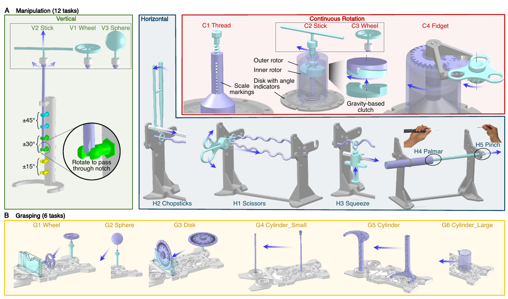

# PoMDAR Benchmark

MuJoCo simulation assets for the **Orca hand** and all **18 PoMDAR benchmark tasks**, plus a webcam teleoperation example.

---

## PoMDAR v2 is in progress

Following user feedback, we are working on a **more stable and reliable version** of the benchmark, planned for release in **August 2026**.  
For suggestions, complaints, or feedback, please open a [GitHub Issue](../../issues).



---

## Contents

```
pomdar_benchmark/
├── sim/                        # MuJoCo scene: hand + task objects
│   ├── hand/                   #   Orca hand MJCF models
│   ├── tasks/                  #   17 PoMDAR task fragments
│   ├── assets/                 #   Meshes, textures
│   ├── launch_mujoco_orca.py   #   Passive viewer launcher (no teleop)
│   └── README.md               #   Sim-only instructions
├── teleop/                     # Webcam teleop example (self-contained)
│   ├── webcam_teleop.py        #   Main entry point
│   ├── tracker.py              #   MediaPipe hand tracker
│   ├── retargeter.py           #   Gradient-descent retargeter
│   ├── retarget_utils.py       #   Retargeting utilities
│   ├── orcahand_v1b.urdf       #   Hand kinematics (for retargeter FK)
│   ├── orcahand_v1*.xml        #   Orca hand model variants
│   └── *.yaml                  #   Hand scheme + retargeter configs
├── cad/                        # STEP files for all physical task fixtures
│   ├── General/                #   Shared mounting hardware and connectors
│   ├── Vertical/               #   Fixtures for V1–V3 tasks
│   ├── Horizontal/             #   Fixtures for H1–H5 tasks
│   ├── Continuous/             #   Fixtures for C1–C4 tasks
│   └── README.md               #   CAD assembly instructions
├── benchmark_overview-1.png    # Benchmark overview figure
├── requirements.txt            # minimal: mujoco only (viewer)
├── requirements-teleop.txt     # full: adds mediapipe, torch, etc.
├── environment.yml             # conda minimal
├── environment-teleop.yml      # conda full (teleop)
└── README.md                   # This file
```

---

## Requirements

- Python **3.10 or 3.11**
- A webcam (for teleoperation only)
- A display with OpenGL support (required by the MuJoCo viewer)

---

## Installation

### Minimal — passive viewer only

Only `mujoco` is needed to open the hand and tasks in the viewer.

```bash
# conda
conda env create -f environment.yml && conda activate pomdar

# pip
pip install -r requirements.txt
```

### Full — webcam teleoperation

Adds MediaPipe, OpenCV, PyTorch, and the retargeter dependencies.

```bash
# conda
conda env create -f environment-teleop.yml && conda activate pomdar-teleop

# pip
pip install -r requirements-teleop.txt
```

> **GPU note:** PyTorch runs on CPU by default, which is sufficient.  
> For faster retargeting with CUDA, replace the `torch` line in `requirements-teleop.txt` with the wheel from [pytorch.org](https://pytorch.org) for your CUDA version.

---

## Running the passive viewer (no webcam)

Visualise any task with the MuJoCo viewer. Run from the `sim/` directory:

```bash
cd sim/
python launch_mujoco_orca.py --task V1_Wheel
python launch_mujoco_orca.py --list-tasks     # print all task names
```

---

## Webcam teleoperation example

> **Disclaimer:** The webcam teleoperation script is provided as a **proof-of-concept example only**. A standard RGB webcam cannot recover reliable 3D wrist pose or absolute hand depth, and MediaPipe landmark accuracy degrades significantly under occlusion, lighting variation, and fast motion. As a result, finger tracking is approximate and wrist positioning is not available.
>
> For accurate, low-latency teleoperation we recommend:
> - **Apple Vision Pro** — [VisionProTeleop](https://github.com/Improbable-AI/VisionProTeleop) provides full 6-DoF wrist pose and high-quality hand landmarks via ARKit.
> - **Motion capture gloves** — e.g. Rokoko, StretchSense, or similar.


- Run from anywhere — all paths are resolved relative to the script:
- Currently can just move the fingers, the hand is fixed in space. The hand base is implemented as a mocap body. Read here for more [mocap mujoco docs](https://mujoco.readthedocs.io/en/stable/modeling.html#mocap-bodies)
```bash
# Bare hand (no task object)
python teleop/webcam_teleop.py

# With a task object loaded
python teleop/webcam_teleop.py --task V1_Wheel
python teleop/webcam_teleop.py --task H2_Chopsticks

# All options
python teleop/webcam_teleop.py --help
```
---

## PoMDAR Tasks

All 18 benchmark tasks. Tasks H4 and H5 uses the same objects, so there are 17 files in total. Pass any `ID` to `--task`.

| ID | Category |
|----|----------|
| `V1_Wheel` | V — Vertical |
| `V2_Stick` | V — Vertical |
| `V3_Sphere` | V — Vertical |
| `C1_Thread` | C — Continuous |
| `C2_Stick` | C — Continuous |
| `C3_Wheel` | C — Continuous |
| `C4_Fidget` | C — Continuous |
| `H1_Scissors` | H — Horizontal |
| `H2_Chopsticks` | H — Horizontal |
| `H3_Squeeze` | H — Horizontal |
| `H4_Palmar_H5_Pinch` | H — Horizontal |
| `G1_Wheel` | G — Grasping |
| `G2_Sphere` | G — Grasping |
| `G3_Disk` | G — Grasping |
| `G4_Cylinder_Small` | G — Grasping |
| `G5_Cylinder` | G — Grasping |
| `G6_Cylinder_Large` | G — Grasping |
