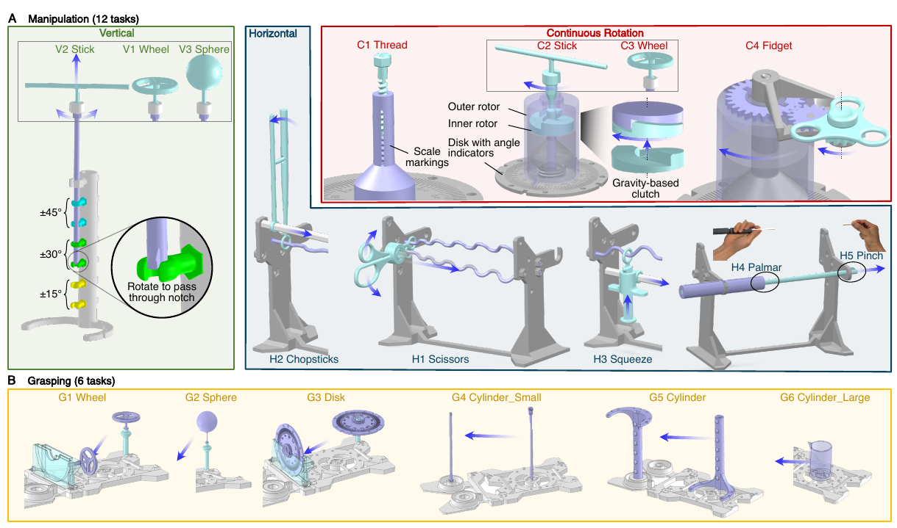
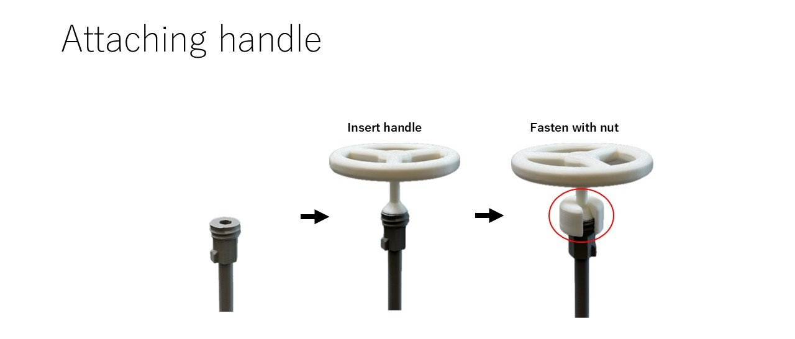
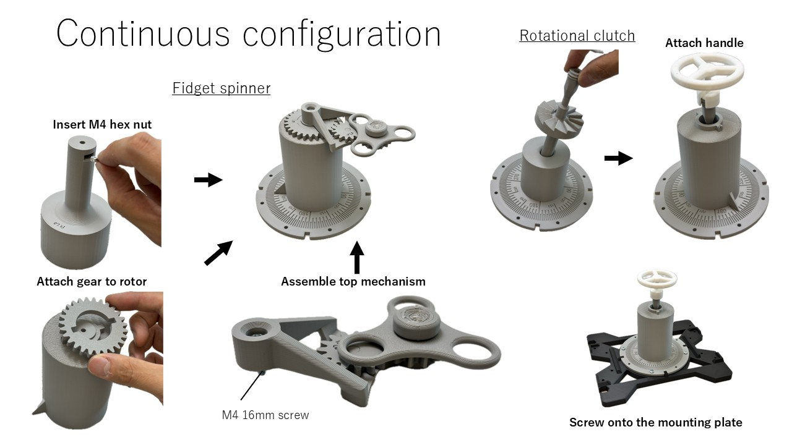
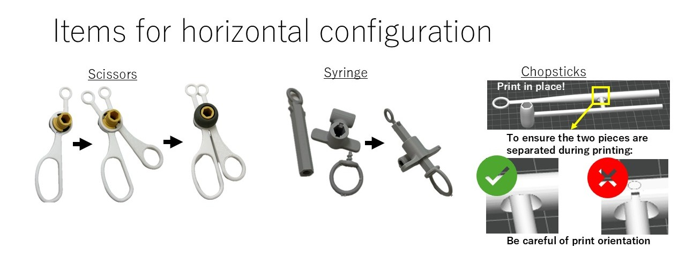
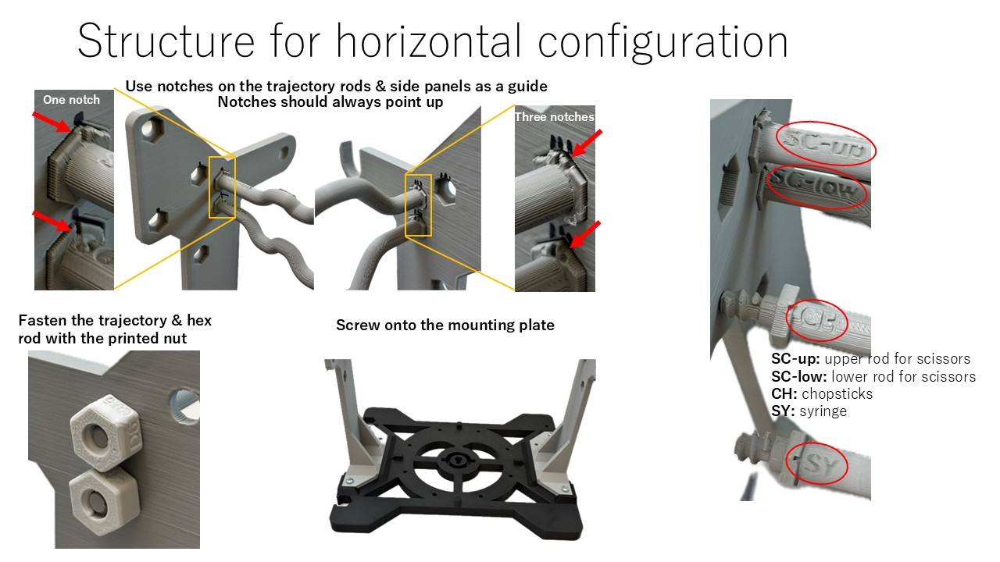

# POMDAR CAD Files

STEP and 3MF files for all physical task fixtures used in the PoMDAR benchmark. Parts are organized by task category. Many components are shared and reused across multiple tasks.

---

## Items required for assembly
- **3D printed parts**: 3MF files (created with Bambu Studio and printed on X1C / P1S) are saved here for all objects. Even if you don't use a Bambu Labs printer, the 3MF files can be used as reference to determine print direction / settings.
- **Table attachment:** Use table clamps to secure the mounting plate and placement plate to any lab bench or table edge.
- **M4 16mm nuts & bolts:** Needed to assemble the items together. 10 pairs should suffice


---
Please refer to this figure from the paper for an overview on how to assemble each task:


And here are in-depth visual guides for some specific items that are harder to assemble:





---

## Directory Structure

```
cad/
├── common/                       # Shared hardware: plates and handles
├── configuration_vertical/       # Task fixtures for V1–V3 (vertical manipulation)
├── configuration_horizontal/     # Task fixtures for H1–H5 (horizontal manipulation)
├── configuration_continuous/     # Task fixtures for C1–C4 (continuous rotation)
└── README.md                     # This file
```

---

## Changelog
### v1.1 (2026-07-08)

Robustified version of the original CAD designs

- use real screws (M4x16mm) in places where the 3D printed screws tended to fail
- increase fillets or make thicker components that tended to fail
- adjust tolerances or slider lengths so that objects don't wobble too much when sliding on trajectories
- more ridges on the rotational clutch task so it clutches easier
- markings and text on the wiggly trajectories and the vertical holder to make it easier to assemble the horizontal configuration

